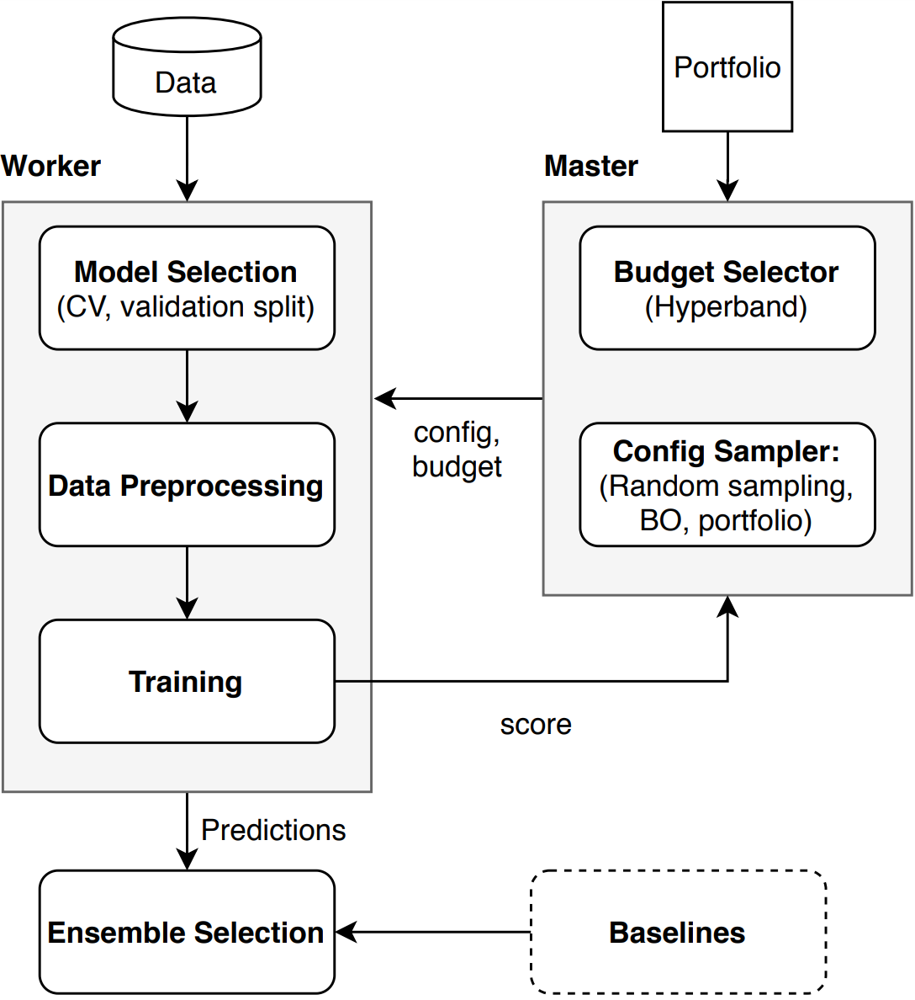

# Auto-PyTorch

Copyright (C) 2021  [AutoML Groups Freiburg and Hannover](http://www.automl.org/)

While early AutoML frameworks focused on optimizing traditional ML pipelines and their hyperparameters, another trend in AutoML is to focus on neural architecture search. To bring the best of these two worlds together, we developed **Auto-PyTorch**, which jointly and robustly optimizes the network architecture and the training hyperparameters to enable fully automated deep learning (AutoDL).

Auto-PyTorch is mainly developed to support tabular data (classification, regression).
The newest features in Auto-PyTorch for tabular data are described in the paper ["Auto-PyTorch Tabular: Multi-Fidelity MetaLearning for Efficient and Robust AutoDL"](https://arxiv.org/abs/2006.13799) (see below for bibtex ref).
Also, find the documentation [here](https://automl.github.io/Auto-PyTorch/development).

***From v0.1.0, AutoPyTorch has been updated to further improve usability, robustness and efficiency by using SMAC as the underlying optimization package as well as changing the code structure. Therefore, moving from v0.0.2 to v0.1.0 will break compatibility. 
In case you would like to use the old API, you can find it at [`master_old`](https://github.com/automl/Auto-PyTorch/tree/master-old).***

## Workflow

The rough description of the workflow of Auto-Pytorch is drawn in the following figure.



In the figure, **Data** is provided by user and
**Portfolio** is a set of configurations of neural networks that work well on diverse datasets.
The current version only supports the *greedy portfolio* as described in the paper *Auto-PyTorch Tabular: Multi-Fidelity MetaLearning for Efficient and Robust AutoDL*
This portfolio is used to warm-start the optimization of SMAC.
In other words, we evaluate the portfolio on a provided data as initial configurations.
Then API starts the following procedures:
1. **Validate input data**: Process each data type, e.g. encoding categorical data, so that Auto-Pytorch can handled.
2. **Create dataset**: Create a dataset that can be handled in this API with a choice of cross validation or holdout splits.
3. **Evaluate baselines** *1: Train each algorithm in the predefined pool with a fixed hyperparameter configuration and dummy model from `sklearn.dummy` that represents the worst possible performance.
4. **Search by [SMAC](https://github.com/automl/SMAC3)**:\
    a. Determine budget and cut-off rules by [Hyperband](https://jmlr.org/papers/volume18/16-558/16-558.pdf)\
    b. Sample a pipeline hyperparameter configuration *2 by SMAC\
    c. Update the observations by obtained results\
    d. Repeat a. -- c. until the budget runs out
5. Build the best ensemble for the provided dataset from the observations and [model selection of the ensemble](https://www.cs.cornell.edu/~caruana/ctp/ct.papers/caruana.icml04.icdm06long.pdf).

*1: Baselines are a predefined pool of machine learning algorithms, e.g. LightGBM and support vector machine, to solve either regression or classification task on the provided dataset

*2: A pipeline hyperparameter configuration specifies the choice of components, e.g. target algorithm, the shape of neural networks, in each step and 
(which specifies the choice of components in each step and their corresponding hyperparameters.

## Installation

### Manual Installation

We recommend using Anaconda for developing as follows:

```sh
# Following commands assume the user is in a cloned directory of Auto-Pytorch

# We also need to initialize the automl_common repository as follows
# You can find more information about this here:
# https://github.com/automl/automl_common/
git submodule update --init --recursive

# Create the environment
conda create -n auto-pytorch python=3.8
conda activate auto-pytorch
conda install swig
cat requirements.txt | xargs -n 1 -L 1 pip install
python setup.py install

```

## Examples

In a nutshell:

```py
from autoPyTorch.api.tabular_classification import TabularClassificationTask

# data and metric imports
import sklearn.model_selection
import sklearn.datasets
import sklearn.metrics
X, y = sklearn.datasets.load_digits(return_X_y=True)
X_train, X_test, y_train, y_test = \
        sklearn.model_selection.train_test_split(X, y, random_state=1)

# initialise Auto-PyTorch api
api = TabularClassificationTask()

# Search for an ensemble of machine learning algorithms
api.search(
    X_train=X_train,
    y_train=y_train,
    X_test=X_test,
    y_test=y_test,
    optimize_metric='accuracy',
    total_walltime_limit=300,
    func_eval_time_limit_secs=50
)

# Calculate test accuracy
y_pred = api.predict(X_test)
score = api.score(y_pred, y_test)
print("Accuracy score", score)
```

For more examples including customising the search space, parellising the code, etc, checkout the `examples` folder

```sh
$ cd examples/
```


Code for the [paper](https://arxiv.org/abs/2006.13799) is available under `examples/ensemble` in the [TPAMI.2021.3067763](https://github.com/automl/Auto-PyTorch/tree/TPAMI.2021.3067763`) branch.

## Contributing

If you want to contribute to Auto-PyTorch, clone the repository and checkout our current development branch

```sh
$ git checkout development
```

## License

This program is free software: you can redistribute it and/or modify
it under the terms of the Apache license 2.0 (please see the LICENSE file).

This program is distributed in the hope that it will be useful,
but WITHOUT ANY WARRANTY; without even the implied warranty of
MERCHANTABILITY or FITNESS FOR A PARTICULAR PURPOSE.

You should have received a copy of the Apache license 2.0
along with this program (see LICENSE file).

## Reference

Please refer to the branch `TPAMI.2021.3067763` to reproduce the paper *Auto-PyTorch Tabular: Multi-Fidelity MetaLearning for Efficient and Robust AutoDL*.

```bibtex
  @article{zimmer-tpami21a,
  author = {Lucas Zimmer and Marius Lindauer and Frank Hutter},
  title = {Auto-PyTorch Tabular: Multi-Fidelity MetaLearning for Efficient and Robust AutoDL},
  journal = {IEEE Transactions on Pattern Analysis and Machine Intelligence},
  year = {2021},
  note = {also available under https://arxiv.org/abs/2006.13799},
  pages = {3079 - 3090}
}
```

```bibtex
@incollection{mendoza-automlbook18a,
  author    = {Hector Mendoza and Aaron Klein and Matthias Feurer and Jost Tobias Springenberg and Matthias Urban and Michael Burkart and Max Dippel and Marius Lindauer and Frank Hutter},
  title     = {Towards Automatically-Tuned Deep Neural Networks},
  year      = {2018},
  month     = dec,
  editor    = {Hutter, Frank and Kotthoff, Lars and Vanschoren, Joaquin},
  booktitle = {AutoML: Methods, Sytems, Challenges},
  publisher = {Springer},
  chapter   = {7},
  pages     = {141--156}
}
```

## Contact

Auto-PyTorch is developed by the [AutoML Group of the University of Freiburg](http://www.automl.org/).
